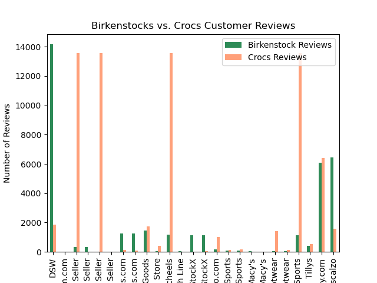
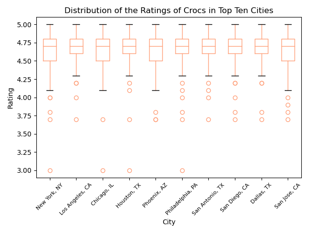
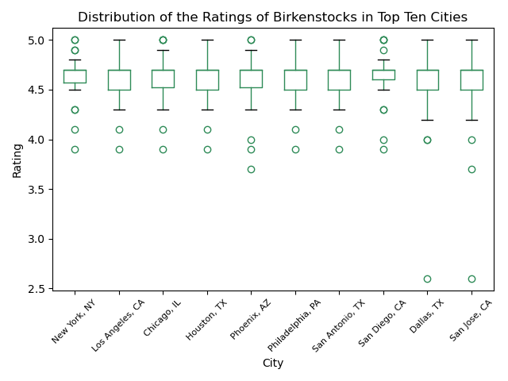
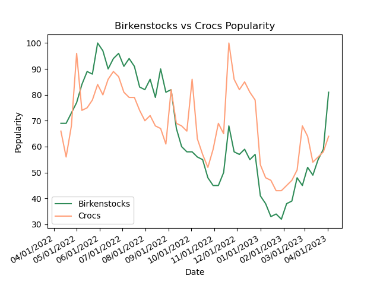
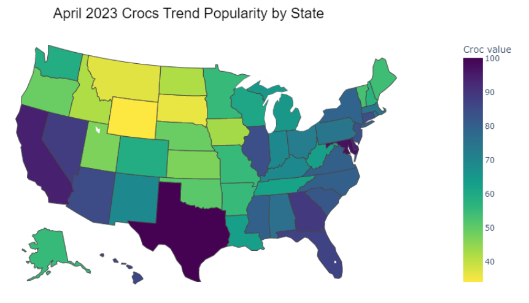
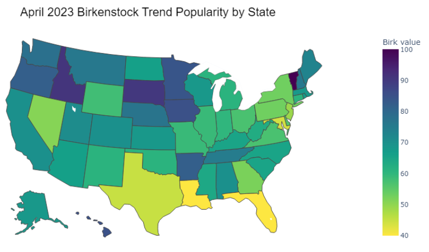
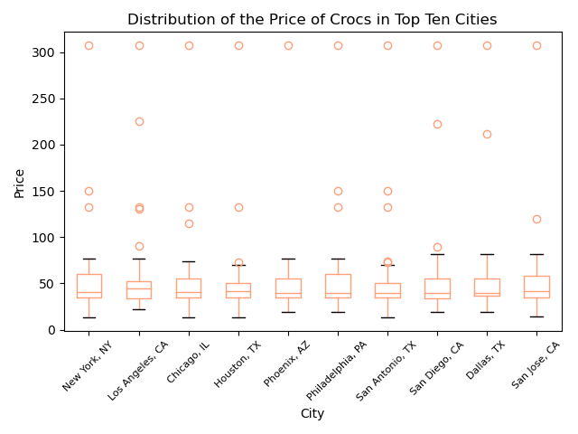
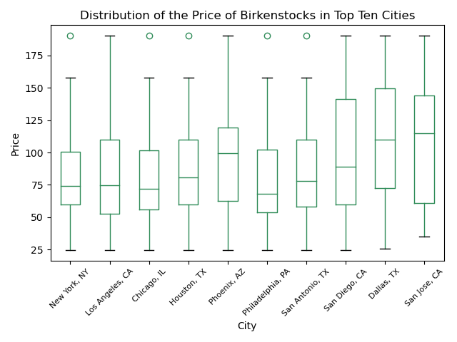

# BirkCroc
Project 1

| Member  | Sections | Responsibilities |
| ------------- | ------------- | ------------- |
| Brittany Brooks  | Google Shopping- product reviews & pricing by seller  | Pulled, cleaned Shopping data & graphs; Presentation slides |
| Kyara Martinez  | Google Shopping- product reviews & pricing by top 10 cities  | Pulled, cleaned Shopping Reviews & Ratings; Boxplots by city; Analysis write-up; Presentation Slides|
| Noelle Martinez | Google Trends data analysis| Pulled, cleaned Trends data & graphs/maps; Repo manager |

## Project Description
Birkenstock and Crocs were founded in 1774 and 2001, respectively. With over 200 years difference, the two shoes have risen in popularity the past few years along with the pandemic and stay-at-home orders. They are both considered ugly, unfashionable, and all together a defiant staple for comfort-seeking customers. 
Our project's core question is whether Crocs or Birkenstocks are close competition. The project will be an observational study of shoe trends in the US. Are there regional differences among the popularity of the two, whether ratings and price vary? We are interested in this question as two members own a pair of ugly shoes and the third is interested in fashion.

## Research Questions
* Where are the best markets for both of these brands?
* Are there seasonal trends in Google searches for the two brands?
* Do we see a difference in ratings among the selling sources?
* Does price impact shoe ratings and reviews?

## Datasets used
* Google Trends
* Google Shopping

## Locations of Project Deliverables
| Objective | Location |
| --------- | -------- |
| Presentation | [Google Slides](https://docs.google.com/presentation/d/1cm8ZG2BboMqsSetozpw5tMyKInp_Iahw8aYyBYXn1VI/edit?usp=sharing/) |
| Code | team project.ipynb |

## Analysis Results

While analyzing the data we were able to find that Crocs received more overall reviews from customers over the course of the last year when directly compared to the number of croc reviews. While comparing reviews from multiple online stores which can be seen on the “Birkenstocks vs Crocs Reviews” graph we were able to notice a very similar number of reviews for both brands on three particular websites - Dick's Sporting Goods,Backcountry.com, and Tillys. Aside from these stores there was not a noticeable correlation in the number of reviews between the two brands.

Once we looked over the data regarding the number of customer reviews we wondered if there would be a difference in the overall customer rating of the shoes over the course of the last year. The data gave us a clear visual that both brands consistently received very similar ratings from customers. Although both brands did have outlier reviews which are shown in our box plots titled “distributions of the ratings”. The outliers for both shoe brands were lower ratings which led us to conclude that both shoe brands received a very similar overall customer rating, which was four stars or higher. 

Based on the data we reviewed from google trends we noticed that Birkenstocks were trending higher than Crocs from May of 2022 to September of 2022. Beginning in October of 2022 the shoe brands switched roles in popularity and Crocs began trending higher than Birkenstocks. Crocs continues to trend higher than birkenstocks through March of 2023. As of April of 2023 Birkenstocks has regained its position of trending higher than Crocs. Our line graph titled “Birkenstocks vs Crocs Popularity” gives us the visual data we need to come to the conclusion that over the span of the last 12 months, trending popularity is split evenly between both Birkenstocks and Crocs. Each brand had about 6 months of being the higher trending shoe brand.

Through our data analysis we were able to learn that the overall popularity of the individual shoe brands is heavily impacted by location. An interesting discovery was that the brands hold popularity in differing locations. For example, Crocs were very popular on the east coast as well as Texas and California, whereas Birkenstocks were shown to be more popular in the midwest as well as Vermont. This data is shown through our heat maps titled “April 2023 Birkenstock Trend Popularity by State” and “ April 2023 Crocs Trend Popularity by State”. These visual representations of the data we collected and analyzed were very helpful in seeing the difference in popularity across the country. 

 

Lastly we sought out to find if there was a correlation in price between Birkenstocks and Crocs. Based on our data we were able to conclude that there is not much of a relation in price between Crocs and Birkenstocks. Birkenstocks appeared to be consistently higher in price than Crocs across not only every website besides one but every city within the top 10 cities that we analyzed. Furthermore, the price of Birkenstocks appeared to vary much more across the country than Croc prices. Croc prices proved to be mostly within the $50 - $75 range whereas Birkenstock prices proved to mostly be within the $50 to $150 range.  

## Major Findings

1. The popularity of each brand occupies entirely separate portions of the country. 
2. Ratings among the two brands proved to be very similar. Through the data we were able to conclude that most customers of both brands were satisfied with their purchase.
3. While the popularity of the brands is not exactly correlated, we were able to notice that the upward and downward trends of the brands appeared to follow a similar pattern.
4. Within the Birkenstocks brand there is a large amount of variation in price point, while Crocs maintained its prices within a smaller range and lower price point.
